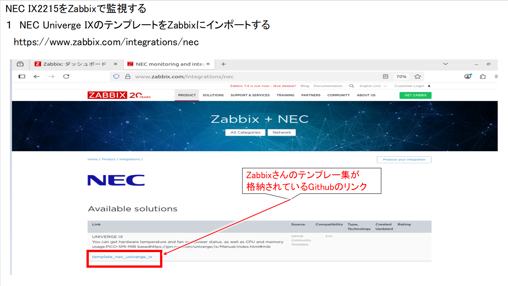
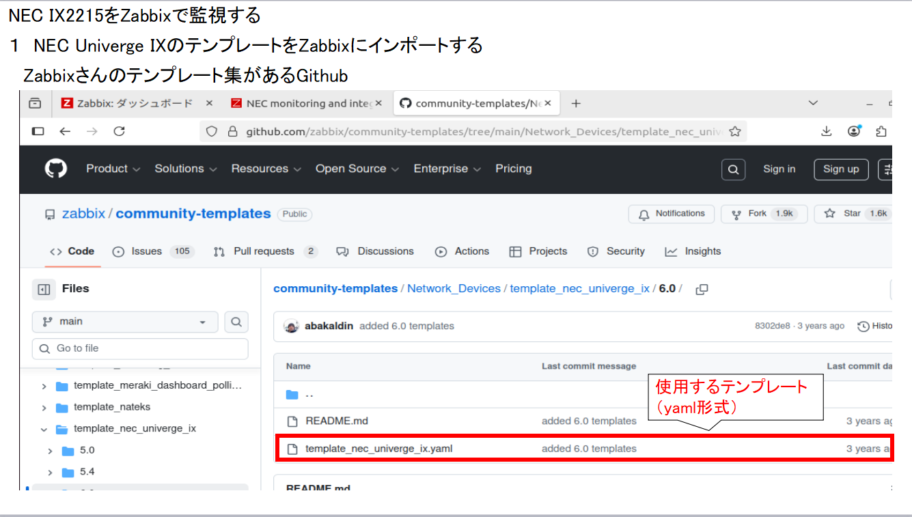
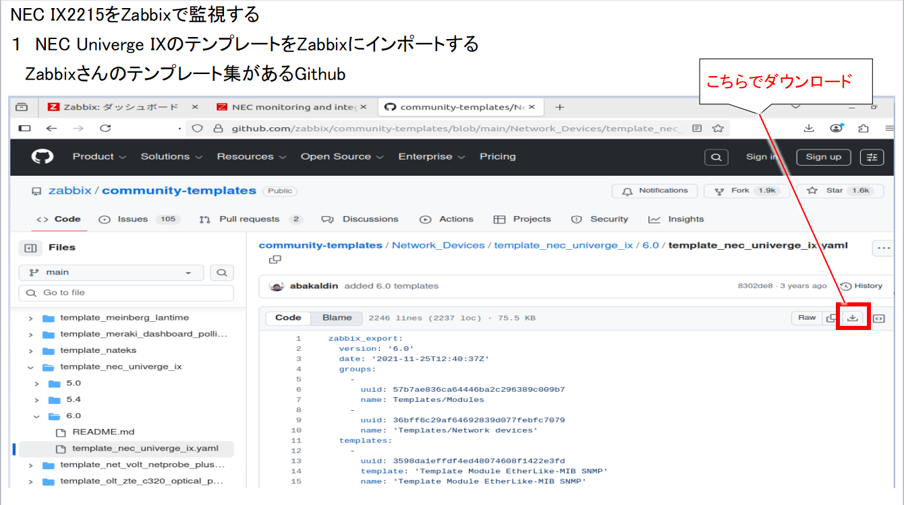
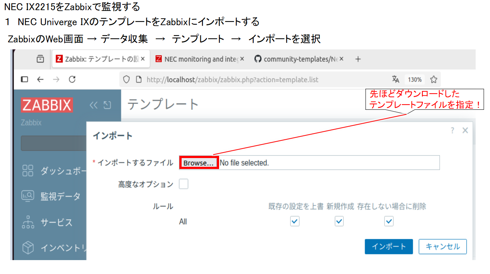
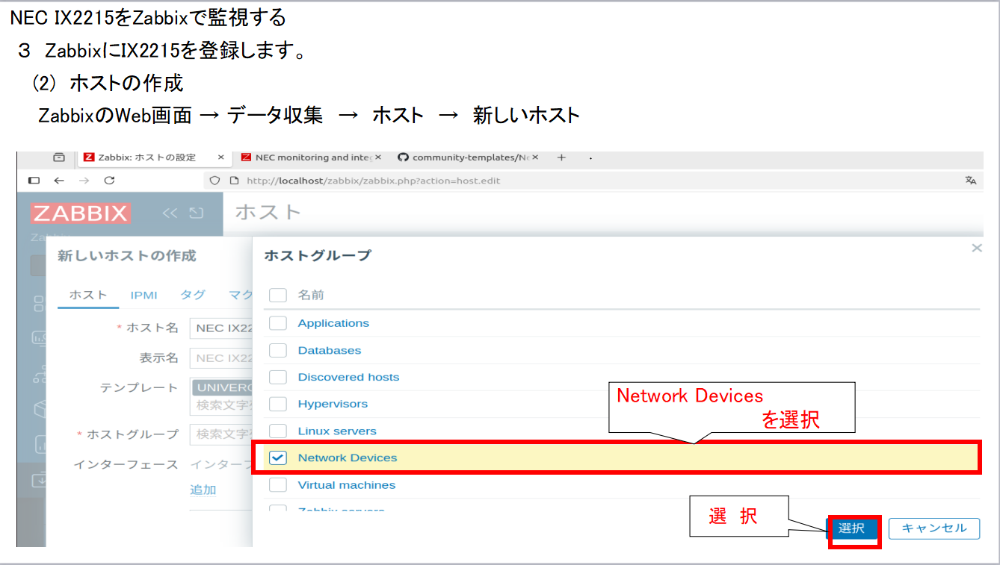

[目次に戻る](./README.md)  

# ネットワーク機器監視設定と確認

##(今回監視する機器) 

NEC IX2025 
監視方式　　　：SNMPVer2 
監視IPアドレス：192.168.10.254 

##今回の構成
 
NEC IX2025をSNMPVer2を使用してZabbixで監視できるようにします！ 

## 実施要領

### １ NEC Univerge IXのテンプレートをZabbixにインポートする 
 Zabbixには標準でIXのテンプレートはインストールされていないのでインポートを実施 
 以下からZabbixのIX用テンプレートをダウンロードできます！ 
 https://www.zabbix.com/integrations/nec 

 

リンクをクリックするとZabbixさんのGithubにいくことができます！ 
 https://github.com/zabbix/community-templates/tree/main/Network_Devices/template_nec_univerge_ix 

 
 
 

上記のようにyamlファイルが該当のテンプレートなのでダウンロードします 

次にZabbixサーバーにログインして 

　ZabbixのWeb画面 → データ収集　→　テンプレート　→　インポートを選択 
 
 
 

これでテンプレートがインポートできました！ 

　テンプレート名はちなみに　”UNIVERSE　IX”　になります！ 

### ２ NEC IX2025の設定 
 IXがSNMPに応答するようにエージェントの設定と、障害発生時にトラップを発生させるように設定 
 

### ３ ZabbixにIX2215を登録します 
　(1) ホストグループの作成 
　　ネットワークデバイスのホストグループがなかったため、新規作成 
 
 
 
　　
　(2) ホストの設定 
　　SNMPエージェントとしてNEC IX2025を登録 
　　(今回の条件） 
　　名前 
　　：　NEC-IX2215-1（任意の名前） 
    テンプレート 
　　：UNIVERSE IX 
    ホストグループ
　　：NETWORK　DEVICE(先ほど作成したもの） 
　　インタフェース 
　　：SNMP　 192.168.10.254（NEC　IX2215のIPアドレス） 
　　　　　　：SNMP Ver SNMPVer2 
　　　　　　：SNMPコミュニティ gorosuke 
　　　　　　
 
 
 
 
 

### ４ NEC IX2215の監視確認 
　　NEC IX2215がSNMPで監視できているかを確認 
 
 
　　
　　
　　
### ５　グラフの作成及び確認 
   今回はGe0.0及びGe1.0のインタフェースの送受信ビット数のグラブを作成 
 
 
 
 
 

正しくグラフが表示されるかを確認します 

NEC IX2025の対向に設置されているJuniper SRX100からIX2025のインタフェースに対してPINGを送信します！ 

 
 
   
   
 
