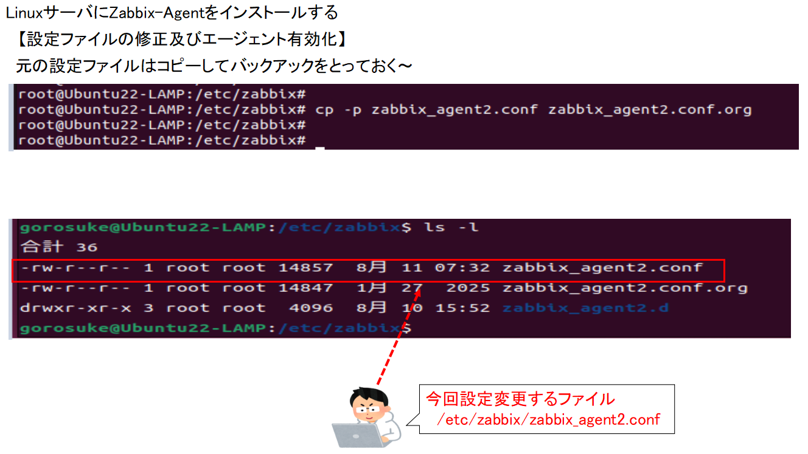

[目次に戻る](./Junos-BGP-exercises.md)  

# Zabbix-agentのインストールと確認

##(今回実施したOS条件) 

仮想マシン 
OS：Ubuntu22 
Zabbix-agent Ver：Zabbix agent6.4 

##今回の構成
,br>
VirtualBOX上に構成したZabbix-agentをZabbixサーバーから監視できる状態にします 

## 実施要領
###【ダウンロード&展開&インストール】 　　
　(1) Zabbixサイトから該当のZabbixエージェントのdebファイルをダウンロード 
　(2) dpkgコマンドにより展開します 
　(3) apt installコマンドによりインストールを実施します 

###【設定ファイルの修正及びエージェント有効化】 
  (1) Zabbix-agent2のconfig(/etc/zabbix/zabbix_agent2.conf)を修正します 
　(2) Zabbix-agent2の再起動及び有効化を実施します 

###【Zabbixサーバによる設定及び確認】
　(1）WebUIにログイン後、データ収集→ホストを選択します 
　(2) ホストの作成を選択/設定します 
　(3) 作成したホストのAvailabilityが緑色になることを確認します 
　(4) Zabbix-agent2をインストールした端末で状態を確認します 

##　細部手順及び確認
###【ダウンロード&展開&インストール】 　　
　(1) Zabbixサイトから該当のZabbixエージェントのdebファイルをダウンロード 
wget https://repo.zabbix.com/zabbix/6.4/ubuntu/pool/main/z/zabbix-release/zabbix-release_6.4-1+ubuntu22.04_all.deb 

　　  

　(2) dpkgコマンドにより展開します 

　　  

　(3) apt installコマンドによりインストールを実施します 　
　
　　 
　　 
　　　
###【設定ファイルの修正及びエージェント有効化】 
(1) Zabbix-agent2のconfig(/etc/zabbix/zabbix_agent2.conf)を修正します 

　　 
　　 
　　　
(2) Zabbix-agent2の再起動及び有効化を実施します 
    #systemctl restart zabbix-agent2（再起動） 
    #systemctl enable zabbix-agent2 （有効化） 
    
     
　　　
###【Zabbixサーバによる設定及び確認】
(1）WebUIにログイン後、データ収集→ホストを選択します 
　　 
　　　
(2) ホストの作成を選択/設定します 
　　 
　　 
　　 
　　 
　　 
　　 
　　 
　　
(3) 作成したホストのAvailabilityが緑色になることを確認します 
　　 
　　 
　　
(4) Zabbix-agent2をインストールした端末で状態を確認します 
     
   
　　
　　　
　
　　　

　　　

