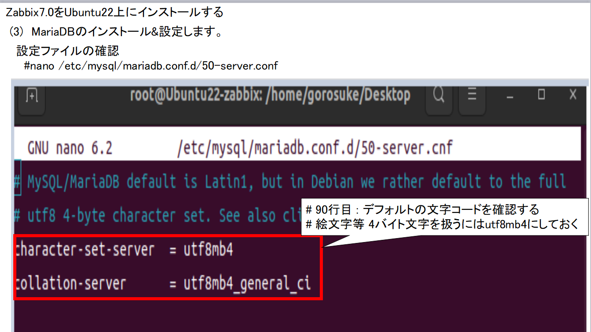

[目次に戻る](./README.md)  

# Zabbixサーバーのインストールと確認

## (今回実施したOS条件) 
### 仮想化環境：VirtualBOX
    仮想マシン　OS：Ubuntu22　　メモリー：4096Ｍ　CPU：２　　　gorosuke/root123
　  Webサーバ(Apache）
　　PHP：Ver8.1及びPHP-fpm
　　DBサーバ：MariaDB
　　Zabbixバージョン:Zabbix Ver7
　　
## 今回の構成
 
VirtualBOX上に構成したUbuntuにZabbixサーバーをインストールします！ 

## 実施手順
　　
(1)　Ubuntuをアップデートします。
(2)　Apache2をインストール&設定します。
(3)　MariaDBのインストール&設定します。
(4)　PHPとPHP-fpmのインストール&設定します。
(5)　Zabbixのインストールします。
(6)　ZabbixのWebインタフェースにアクセスし、設定します。
(7)　ZabbixのWebインタフェースにアクセスし、ログインします。
(8)　Zabbixのステータスを確認します。

参考サイト
Ubuntu22.04にZabbix7を構築
https://falconblog.org/zabbix-construct-v1/

## 事前準備
　Ubuntuのキーボード配列を英語キーボード→日本語キーボードに変更しておきます
　 

## 実施手順
　(1)　Ubuntuをアップデートします。 
　 
　 インターネットに接続した状態で以下のコマンドを実行します! 
　 　#apt updateコマンド,#apt autoremoveを実行します！ 
　  
　  
　 
　 (2)　Apache2をインストール&設定します。 
　  インターネットに接続した状態で以下のコマンドを実行します! 
　  #apt install apache2
　   
　  インストール後、起動確認でUbuntuのマシンからブラウザでApache2の起動確認を実施します
　  　http://localhost
　   
　  
　  (3)　MariaDBのインストール&設定します。
　   ①　インストール 
　   #apt install mariadb-serverを実行します! 
　   
　  
　   ②　設定ファイルの確認 
　   #nano /etc/mysql/mariadb.conf.d/50-server.conf 
　    
　   
　   図のように90行目:(Character-set-server)は デフォルトの文字コードを確認する 
     # 絵文字等 4バイト文字を扱うにはutf8mb4にしておく 
     
     ③　MariaDBを再起動後、インストール作業を実施 
     # mysql_secure_installation 
      
     
     ④　PHPとPHP-fpmのインストール&設定します。 
     ア　PHP及びPHP-fpmのインストール 
      #apt install php8.1 php8.1-mbstring php-pear 
      
     
     イ　インストール完了後、PHPのバージョン情報を確認します 
     #php -v 
      
     
     ウ　インストール後、PHPの設定情報をブラウザで確認できるようにします。 
      
      
     (参考）PHPの設定情報をコマンドでも確認が可能です！ 
     
     エ　PHP-fpmをインストールします。 
     
     関連してApacheの連携モジュールもインストールします 
     #a2emod proxy_fcgi setenvif 
     #a2emod php8.1-fpm 
     
     設定後、再度、PHPの設定情報をブラウザで確認できるようにします。 
     
     (4)  
     
     (5)　Zabbixのインストール 
       Wgetコマンドを使用してZabbixをダウンロードします 
     　　 
     　dpkgコマンドによるZabbixの展開 
     　　 
     　Zabbixで使用する関連ファイルをダウンロード 
     　　 
     　DB（MariaDB）にログイン及び設定 
     　　 
     　Zabbixの初期データベース構築 
     　（Zabbix が動作するのに必要なテーブルや初期データが作成される） 
     　　 
     　DB（MariaDB）にログイン及び設定変更 
     　　 
     　Zabbix側のDB接続設定を実施 
     　　 
     　　 
     　　 
     　Zabbixサーバの再起動及び有効化 
     　　 
     　Zabbixエージェントの設定変更及びエージェント再起動 
     　　 
     　PHP8.1のFPM関連ファイルの設定 
     　　 
     　　ZabbixのWebインタフェースにアクセスし、確認します 
     　　 
     　　データベースの接続設定を実施します 
     　　 
     　　サーバ名、タイムゾーン等を設定します。

